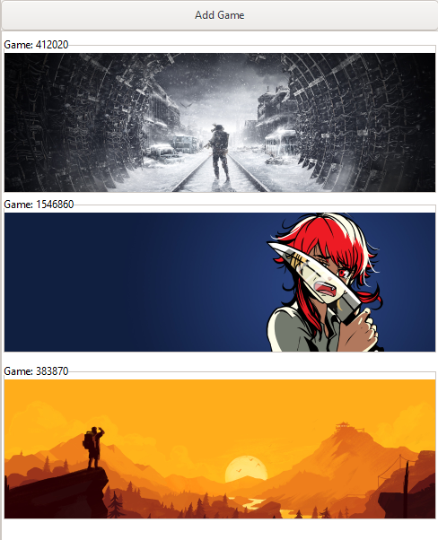

<div id="top"></div>
<!--
*** Thanks for checking out the Best-README-Template. If you have a suggestion
*** that would make this better, please fork the repo and create a pull request
*** or simply open an issue with the tag "enhancement".
*** Don't forget to give the project a star!
*** Thanks again! Now go create something AMAZING! :D
-->


<!-- PROJECT SHIELDS -->
<!--
*** I'm using markdown "reference style" links for readability.
*** Reference links are enclosed in brackets [ ] instead of parentheses ( ).
*** See the bottom of this document for the declaration of the reference variables
*** for contributors-url, forks-url, etc. This is an optional, concise syntax you may use.
*** https://www.markdownguide.org/basic-syntax/#reference-style-links
-->


<!-- PROJECT LOGO -->
<br />
<div align="center">
  <a href="https://github.com/iPanja/steam-idler">
    
  </a>

<h3 align="center">Steam Idler</h3>

  <p align="center">
    Automatically idle steam games in the background for card drops and hours played!
    <br />
    <br />
    <a href="https://github.com/iPanja/steam-idler">View Demo</a>
    ·
    <a href="https://github.com/iPanja/steam-idler/issues">Report Bug</a>
    ·
    <a href="https://github.com/iPanja/steam-idler/issues">Request Feature</a>
  </p>
</div>


<!-- ABOUT THE PROJECT -->
## About The Project
<div align="center">
    
</div>

<p align="right">(<a href="#top">back to top</a>)</p>


<!-- GETTING STARTED -->
## Getting Started

After a couple gruesome hours, I have figured out to compile a GTK+ project.
To install GTK in the first place, follow [these](https://www.gtk.org/docs/installations/windows) instructions.

Currently, the UI will only compile/work on Windows machines. UNIX users can run the steam-idler (`./si` executable) from the command-line using: `./si <app_id> <duration>`. Duration can be set to `-1` to run forever.

### Prerequisites

After following the aforementioned instructions with MSYS2, all the prerequisites should be installed. If the program appears to crash at any point, it is probably due to a missing DLL (goodluck).

### Build
#### Using the makefile

Running `make` will automatically run the appropriate platform-specific make file, however only the Windows makefile will compile the UI (UNIX support will be implemented in the future).

The makefile will compile the entire project, bundle the GTK binaries (listed in dependencies.txt), and copy over the Steam API dll/lib into the subfolder: `release/`.

#### Build yourself
1. Get the required DLLs (default: dependencies.txt) using [ListDLLs](https://docs.microsoft.com/en-us/sysinternals/downloads/listdlls) in **POWERSHELL**
* If this does not work, after launching the program get it's process ID via task manager and supply that number instead of `idler.exe`
```
.\tools\Listdlls.exe idler.exe > dependencies.txt
```
2. Copy the required DLLs over
```
for file in `cat dependencies.txt`; do mkdir -p ".\release\bin" && cp "$$file" ./release/bin/; done
```
3. Get the appropriate Steam API DLL and place it in the same folder as the executable. Windows ones are located in `redistributable_bin/win64`

4. Compile
```
gcc steam_idler.c -o release/si "redistributable_bin/win64/steam_api64.lib"
gcc `pkg-config --cflags gtk+-3.0` ui.c -o release/idler `pkg-config --libs gtk+-3.0` -lregex -Wl,--export-all-symbols -mwindows
```

<p align="right">(<a href="#top">back to top</a>)</p>


<!-- USAGE EXAMPLES -->
## Usage

Run `idler.exe`!

If for some reason it does not open up, or it appears to crash after clicking "ADD GAME" you are probably missing a required DLL. It can be hard to debug which one it is, so refer back to the dependencies.txt file first.

<p align="right">(<a href="#top">back to top</a>)</p>


<!-- ROADMAP -->
## Roadmap
After taking a break from dealing with building a GTK project...
- [x] Cleanup library.c
- [ ] Add linux support in creating/killing the new process (`ui.c`)
- [ ] Re-format the add a game window/list
- [ ] Get an app's name from its APP ID to make the application more user-friendly

<p align="right">(<a href="#top">back to top</a>)</p>


<!-- ACKNOWLEDGMENTS -->
## Acknowledgments
* [Sleep Icon (Fuzzee)](https://www.flaticon.com/free-icons/sleep)
* [Fake steam process method (Miouyouyou)](https://gist.github.com/Miouyouyou/2543eb6fb66d7682c85b42f1b4c4d381#file-steam-idler-c)
* [Locate DLLs for GTK building (bradrn)](https://stackoverflow.com/questions/49092784/how-to-distribute-a-gtk-application-on-windows)

<p align="right">(<a href="#top">back to top</a>)</p>


<!-- MARKDOWN LINKS & IMAGES -->
<!-- https://www.markdownguide.org/basic-syntax/#reference-style-links -->
[contributors-shield]: https://img.shields.io/github/contributors/iPanja/steam-idler.svg?style=for-the-badge
[contributors-url]: https://github.com/iPanja/steam-idler/graphs/contributors
[forks-shield]: https://img.shields.io/github/forks/iPanja/steam-idler.svg?style=for-the-badge
[forks-url]: https://github.com/iPanja/steam-idler/network/members
[stars-shield]: https://img.shields.io/github/stars/iPanja/steam-idler.svg?style=for-the-badge
[stars-url]: https://github.com/iPanja/steam-idler/stargazers
[issues-shield]: https://img.shields.io/github/issues/iPanja/steam-idler.svg?style=for-the-badge
[issues-url]: https://github.com/iPanja/steam-idler/issues
[license-shield]: https://img.shields.io/github/license/iPanja/steam-idler.svg?style=for-the-badge
[license-url]: https://github.com/iPanja/steam-idler/blob/master/LICENSE.txt
[linkedin-shield]: https://img.shields.io/badge/-LinkedIn-black.svg?style=for-the-badge&logo=linkedin&colorB=555
[linkedin-url]: https://linkedin.com/in/linkedin_username
[product-screenshot]: screencap.png
