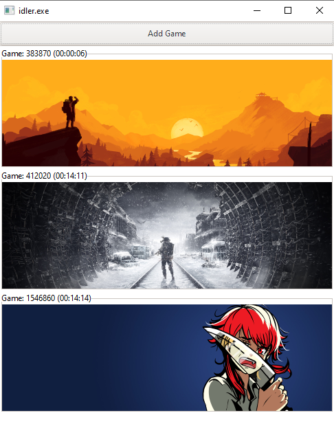

<div id="top"></div>
<!--
*** Thanks for checking out the Best-README-Template. If you have a suggestion
*** that would make this better, please fork the repo and create a pull request
*** or simply open an issue with the tag "enhancement".
*** Don't forget to give the project a star!
*** Thanks again! Now go create something AMAZING! :D
-->


<!-- PROJECT SHIELDS -->
<!--
*** I'm using markdown "reference style" links for readability.
*** Reference links are enclosed in brackets [ ] instead of parentheses ( ).
*** See the bottom of this document for the declaration of the reference variables
*** for contributors-url, forks-url, etc. This is an optional, concise syntax you may use.
*** https://www.markdownguide.org/basic-syntax/#reference-style-links
-->


<!-- PROJECT LOGO -->
<br />
<div align="center">
  <a href="https://github.com/iPanja/steam-idler">
    
  </a>

<h3 align="center">Steam Idler</h3>

  <p align="center">
    Automatically idle steam games in the background for card drops and hours played!
    <br />
    <br />
    <a href="https://github.com/iPanja/steam-idler">View Demo</a>
    ·
    <a href="https://github.com/iPanja/steam-idler/issues">Report Bug</a>
    ·
    <a href="https://github.com/iPanja/steam-idler/issues">Request Feature</a>
  </p>
</div>


<!-- ABOUT THE PROJECT -->
## About The Project
<div align="center">
    
</div>


<!-- GETTING STARTED -->
## Getting Started

### Windows
Download the newest release (or build yourself) and launch `idler.exe`. The program will automatically scan your steam library allowing you to choose what games to idle in the "Add Game" menu. Your selected games will idle until you either remove them (by clicking on the game's artwork as seen in the picture above) or close the program.

### UNIX

Currently, the UI will only compile/work on Windows machines. To individually idle games you can use the `./si` application from the command line: `./si <app_id> <duration (seconds)>`. _Setting the duration to `-1` will run the game forever._


## Build
### Prerequisites

To install GTK in the first place, follow [these](https://www.gtk.org/docs/installations/windows) instructions. If you are on windows be sure to install MSYS2. If the program appears to crash at any point, it is probably due to a missing DLL (goodluck).

### Using the makefile

Running `make` will automatically run the appropriate platform-specific make file, however only the Windows makefile will compile the UI (UNIX support will be implemented in the future).

The makefile will compile the entire project, bundle the GTK binaries (listed in dependencies.txt), and copy over the Steam API dll/lib into the subfolder: `release/`.

### Build yourself
1. Get the required DLLs (both `bin/` and `lib/`)
* The file `dependencies.txt` contains the paths to all required DLLs for the UI (GTK+) that the current version of the program uses. To copy them over into the release folder:
```
for file in `cat dependencies.txt`; do cp "$$file" ./release/; done
```
* If you modified the program, the DLLs you need might change so to get the dependencies yourself by using [ListDLLs](https://docs.microsoft.com/en-us/sysinternals/downloads/listdlls) while running the program and copy over any DLLs in `/msys2/mingw64/`. Files in `bin/` should be placed in the same directory as the executable (idler.exe) and `lib/` files should retain their structure and be nested properly. Example:
```
.\tools\Listdlls.exe idler.exe > dependencies.txt #Locate dependencies
.\release\lib\gdk-pixbuf-2.0\2.10.0\loaders.cache #Example of how to store libraries (\lib\*)
.\release\lib\gdk-pixbuf-2.0\2.10.0\loaders\libpixbufloader-jpeg.dll
```

3. Move the library files over into their proper structure (`lib/`)
```
mkdir -p .\release\lib\gdk-pixbuf-2.0\2.10.0\loaders
cp ./release/libpixbufloader-jpeg.dll ./release/lib/gdk-pixbuf-2.0/2.10.0/loaders/
cp ./release/loaders.cache ./release/lib/gdk-pixbuf-2.0/2.10.0/
```
4. Get the appropriate Steam API DLL and place it in the same folder as the executable. Windows ones are located in `redistributable_bin/win64`

5. Copy over the other required resources
* main.css
* ui.glade
```
cp ui.glade ./release/ui.glade
cp main.css ./release/main.css
```
6. Compile
* ui.c -> idler.exe (any name works, this is the main executable)
* steam_idler.c -> si.exe (keep this name)
```
gcc steam_idler.c -o release/si "redistributable_bin/win64/steam_api64.lib"
gcc `pkg-config --cflags gtk+-3.0` ui.c -o release/idler `pkg-config --libs gtk+-3.0` -lregex -Wl,--export-all-symbols -mwindows
```

<p align="right">(<a href="#top">back to top</a>)</p>


<!-- USAGE EXAMPLES -->
## Usage

Run `idler.exe`!


### Debugging
If for some reason it does not open up, you are probably missing a DLL. If it appears to crash after clicking "ADD GAME" you probably have the wrong file structure for the image library.
```
.\release\lib\gdk-pixbuf-2.0\2.10.0\loaders.cache
.\release\lib\gdk-pixbuf-2.0\2.10.0\loaders\libpixbufloader-jpeg.dll
```


<!-- ROADMAP -->
## Roadmap
After taking a break from dealing with building a GTK project...
- [ ] Add linux support in creating/killing the new process (`ui.c`)
- [ ] Re-format the add a game window/list
- [ ] Get an app's name from its APP ID to make the application more user-friendly
- [ ] Cleanup the process of restarting idlers when the connection to Steam goes down
- [ ] Transfer to a new UI library that requires less DLLs


<!-- ACKNOWLEDGMENTS -->
## Acknowledgments
* [Sleep Icon (Fuzzee)](https://www.flaticon.com/free-icons/sleep)
* [Fake steam process method (Miouyouyou)](https://gist.github.com/Miouyouyou/2543eb6fb66d7682c85b42f1b4c4d381#file-steam-idler-c)
* [Locate DLLs for GTK building (bradrn)](https://stackoverflow.com/questions/49092784/how-to-distribute-a-gtk-application-on-windows)

<p align="right">(<a href="#top">back to top</a>)</p>


<!-- MARKDOWN LINKS & IMAGES -->
<!-- https://www.markdownguide.org/basic-syntax/#reference-style-links -->
[contributors-shield]: https://img.shields.io/github/contributors/iPanja/steam-idler.svg?style=for-the-badge
[contributors-url]: https://github.com/iPanja/steam-idler/graphs/contributors
[forks-shield]: https://img.shields.io/github/forks/iPanja/steam-idler.svg?style=for-the-badge
[forks-url]: https://github.com/iPanja/steam-idler/network/members
[stars-shield]: https://img.shields.io/github/stars/iPanja/steam-idler.svg?style=for-the-badge
[stars-url]: https://github.com/iPanja/steam-idler/stargazers
[issues-shield]: https://img.shields.io/github/issues/iPanja/steam-idler.svg?style=for-the-badge
[issues-url]: https://github.com/iPanja/steam-idler/issues
[license-shield]: https://img.shields.io/github/license/iPanja/steam-idler.svg?style=for-the-badge
[license-url]: https://github.com/iPanja/steam-idler/blob/master/LICENSE.txt
[linkedin-shield]: https://img.shields.io/badge/-LinkedIn-black.svg?style=for-the-badge&logo=linkedin&colorB=555
[linkedin-url]: https://linkedin.com/in/linkedin_username
[product-screenshot]: screencap.png
